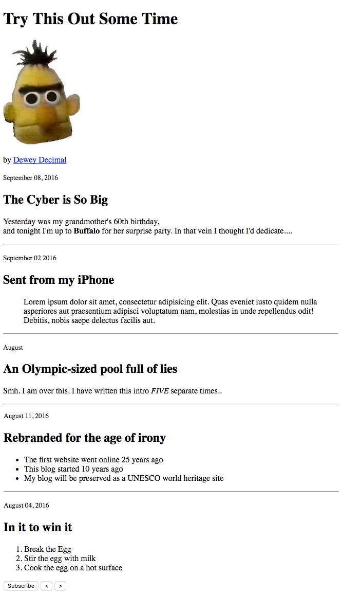

# Create an HTML Document

### Mockup
[mockup](./_mockups/demo-html.png)

### Requirements
- doctype declaration
- head tag
- body tag

- an unordered list of items
- an ordered list of items

- a header element
- h2 tags nested in div element for each article
- p tags nested in div element for each article

- horizontal rule elements to separate article content blocks
